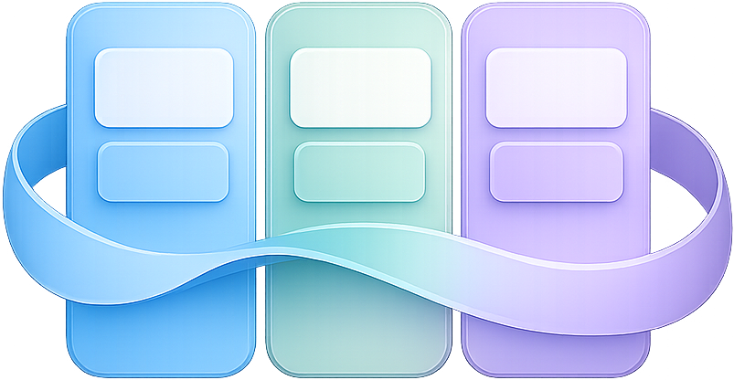

<p align="center">
  
</p>

<h1 align="center">Board</h1>

<p align="center">
  The open-source, self-hosted Kanban — real-time collaboration, a first-class
  <strong>plugin SDK</strong>, and a built-in <strong>MCP server</strong> for AI agents.
</p>

<p align="center">
  
  
  
  
  
</p>

---

**Board** is a Trello-style project board you can run yourself. It is a real-time,
multi-workspace Kanban with a clean mobile UI — and, unlike most alternatives, it
ships a genuine **plugin architecture**: Power-Ups are ordinary Composer packages,
auto-discovered and independently versioned.

## Features

- **Boards, lists & cards** — drag & drop (`wire:sort`), labels, checklists,
  attachments (images / video / files), comments with **@mentions** and emoji
  reactions, start/due dates, cover images and **custom fields**.
- **Views** — board, **calendar**, saved filters/views, WIP limits, collapse,
  bulk actions and keyboard shortcuts.
- **Real-time** — live presence, comments and updates on every open board via
  **Laravel Reverb**; per-user notification preferences.
- **Activity** — a Trello-style activity slide-over with per-plugin tabs.
- **Automations** — trigger/action rules and manual card buttons, plus scheduled runs.
- **Power-Ups / Plugins** — install with `composer require`; a versioned
  [SDK](https://github.com/B-o-a-r-d/Board-Plugin-SDK) lets plugins add read-only
  **list sources**, **card enrichment**, **activity tabs**, **MCP tools** and their
  own translations. First connector: [GitHub](https://github.com/B-o-a-r-d/Github-Plugin).
- **MCP server** — drive boards from AI agents (Model Context Protocol); plugins
  can contribute tools.
- **API** — token auth via Laravel Sanctum, ULID public IDs everywhere.
- **Exports** — CSV / XLSX / JSON. **Public sharing** links with live presence.
- **i18n** — French, English, Spanish. **Dark mode**.

## Quick start (local)

```bash
git clone https://github.com/B-o-a-r-d/board.git && cd board
composer install
cp .env.example .env && php artisan key:generate
# configure DB + APP_TIMEZONE in .env, then:
php artisan migrate
npm install && npm run build

# run everything (server + queue + reverb + vite) in one command:
composer run dev
```

Open the app, register the first user, and create a workspace.

> **Docker / production self-hosting**, GitHub OAuth, Reverb, MCP and more are
> covered in the **[Wiki](../../wiki)**.

## Stack

Laravel 13 · Livewire 4 (bundled Alpine) · Tailwind CSS 4 · Laravel Reverb
(WebSockets) · Sanctum · Laravel MCP · PostgreSQL (SQLite in tests) · Pest 4.

## Plugins

Board's Power-Ups are separate, versioned Composer packages that depend only on the
SDK — never on the app — so you can update a plugin without touching the core.

```bash
composer require board/plugin-github
```

Building your own is a short guide away: **[Creating a plugin](../../wiki/Creating-a-Plugin)**.

## Testing

```bash
php artisan test        # Pest — feature + unit
vendor/bin/pint         # code style
```

## Ecosystem

| Repo | What |
|------|------|
| [board](https://github.com/B-o-a-r-d/board) | The application (this repo) |
| [Board-Plugin-SDK](https://github.com/B-o-a-r-d/Board-Plugin-SDK) | Contracts to build plugins |
| [Github-Plugin](https://github.com/B-o-a-r-d/Github-Plugin) | GitHub Power-Up (commits / PRs / issues + card links) |

## License

Board is open-source software licensed under the [MIT license](https://opensource.org/licenses/MIT).
